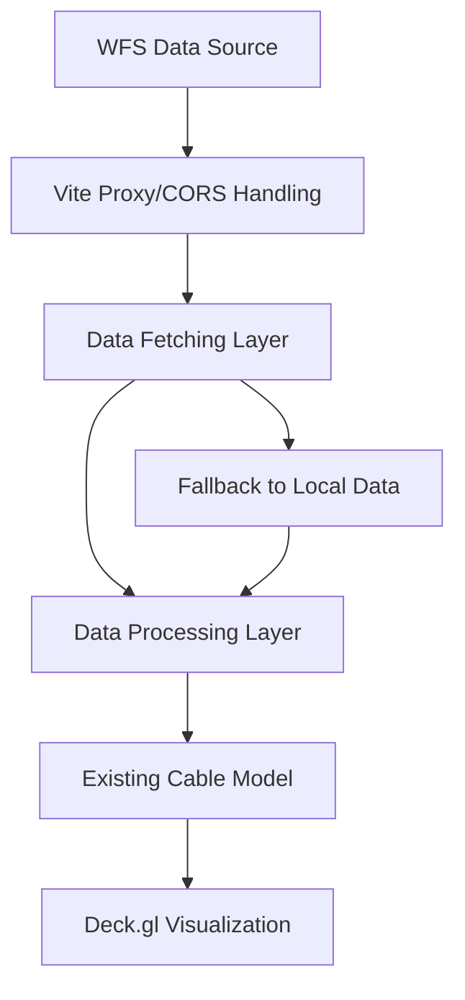

# WFS Configuration for ITU Submarine Cable Data Integration

## 1. Overview

This design document outlines the implementation plan for integrating Web Feature Service (WFS) data from the International Telecommunication Union (ITU) into our mapping infrastructure. The integration will enable real-time visualization of submarine cable infrastructure data from the ITU's geoserver alongside our existing power plant and terrestrial link data.

The implementation will include:
- Fetching live submarine cable data from ITU's WFS service
- Implementing fallback logic to use local test data when the live service is unavailable
- Configuring CORS proxy for development environment
- Processing the fetched GeoJSON data into our existing Cable model

## 2. Architecture

The WFS integration will be implemented as an extension to our existing data loading pipeline. The architecture will follow these key components:



### 2.1 Component Structure

1. **Data Fetching Component** - Responsible for making HTTP requests to the ITU WFS service
2. **Proxy Configuration** - Vite proxy configuration to handle CORS during development
3. **Data Processing Module** - Extends existing CableProcessor to handle ITU GeoJSON format
4. **Fallback Mechanism** - Uses local test data when live data is unavailable
5. **Integration Layer** - Connects WFS data with existing Deck.gl visualization

## 3. API Integration

### 3.1 WFS Endpoint Configuration

The ITU WFS service will be accessed using the following configuration:

| Parameter | Value |
|----------|-------|
| Base URL | https://bbmaps.itu.int/geoserver/itu-geocatalogue/ows |
| Service | WFS |
| Version | 1.0.0 |
| Request | GetFeature |
| Type Name | itu-geocatalogue:trx_geocatalogue |
| Output Format | application/json |

Final constructed URL:
```
https://bbmaps.itu.int/geoserver/itu-geocatalogue/ows?service=WFS&version=1.0.0&request=GetFeature&typeName=itu-geocatalogue:trx_geocatalogue&outputFormat=application/json
```

### 3.2 Development Proxy Configuration

To handle CORS restrictions during development, we'll configure a proxy in `vite.config.ts`:

```typescript
server: {
  port: 3000,
  host: true,
  proxy: {
    '/itu-proxy': {
      target: 'https://bbmaps.itu.int',
      changeOrigin: true,
      rewrite: (path) => path.replace(/^\/itu-proxy/, ''),
      secure: false
    }
  }
}
```

## 4. Data Models

### 4.1 Cable Model Extension

Our existing Cable model will be used for the ITU data:

```typescript
interface Cable {
  id: string;
  name: string;
  coordinates: [number, number][];
}
```

### 4.2 ITU GeoJSON Structure

The ITU GeoJSON data follows this structure:

```json
{
  "type": "FeatureCollection",
  "features": [
    {
      "type": "Feature",
      "properties": {
        "id": "unique_identifier",
        "name": "cable_name",
        // Additional properties from ITU dataset
      },
      "geometry": {
        "type": "LineString",
        "coordinates": [
          [longitude, latitude],
          // ... more coordinate pairs
        ]
      }
    }
  ]
}
```

## 5. Business Logic Implementation

### 5.1 Data Fetching Logic

The data fetching logic will be implemented in a new utility function:

```typescript
// src/utils/wfsDataLoader.ts
export async function loadWfsCableData(): Promise<Cable[]> {
  try {
    const isDevelopment = import.meta.env.MODE === 'development';
    const baseUrl = isDevelopment 
      ? '/itu-proxy/geoserver/itu-geocatalogue/ows'
      : 'https://bbmaps.itu.int/geoserver/itu-geocatalogue/ows';
    
    const params = new URLSearchParams({
      service: 'WFS',
      version: '1.0.0',
      request: 'GetFeature',
      typeName: 'itu-geocatalogue:trx_geocatalogue',
      outputFormat: 'application/json'
    });
    
    const url = `${baseUrl}?${params}`;
    const response = await fetch(url);
    
    if (!response.ok) {
      throw new Error(`Failed to fetch submarine cable data: ${response.status} ${response.statusText}`);
    }
    
    const cableData = await response.json();
    return processWfsCableData(cableData);
  } catch (error) {
    console.warn('Failed to fetch submarine cable data, using test data:', error);
    // Fallback to local test data
    return processWfsCableData(testCables);
  }
}
```

### 5.2 Data Processing Logic

We'll extend the existing geoJsonParser to handle the ITU GeoJSON format:

```typescript
// src/utils/geoJsonParser.ts (extended)
export function processWfsCableData(geoJsonData: GeoJsonObject): Cable[] {
  const cables: Cable[] = [];
  
  if (!geoJsonData || !geoJsonData.features) {
    return cables;
  }
  
  geoJsonData.features.forEach((feature, index) => {
    if (feature.geometry?.type === 'LineString') {
      const props = feature.properties || {};
      const coordinates = feature.geometry.coordinates as [number, number][];
      
      const cable: Cable = {
        id: props.id || `cable_${index}`,
        name: props.name || props.cable_name || `Cable ${index}`,
        coordinates: coordinates
      };
      
      cables.push(cable);
    }
  });
  
  return cables;
}
```

### 5.3 Integration with Existing App

The App.tsx component will be modified to use the new WFS data loader:

```typescript
// src/App.tsx (modified useEffect)
useEffect(() => {
  const loadData = async () => {
    setLoading(true);
    
    try {
      // Load power plant data
      const powerPlantData = await loadPowerPlantData('/data/power_plants.csv');
      
      // Load WFS submarine cable data
      const wfsCableData = await loadWfsCableData();
      
      // Load existing terrestrial link data
      const infrastructureData = await loadInfrastructureData('/data/infrastructure.geojson');
      
      setPowerPlants(powerPlantData);
      setCables(wfsCableData);
      setTerrestrialLinks(infrastructureData.terrestrialLinks);
    } catch (error) {
      console.error('Error loading data:', error);
    } finally {
      setLoading(false);
    }
  };
  
  loadData();
}, []);
```

## 6. Configuration Changes

### 6.1 Vite Configuration Update

The `vite.config.ts` file will be updated to include the proxy configuration:

```typescript
// vite.config.ts
export default defineConfig({
  plugins: [react()],
  server: {
    host: true,
    port: 3000,
    proxy: {
      '/itu-proxy': {
        target: 'https://bbmaps.itu.int',
        changeOrigin: true,
        rewrite: (path) => path.replace(/^\/itu-proxy/, ''),
        secure: false
      }
    }
  },
  build: {
    outDir: 'dist',
    assetsDir: 'assets',
    sourcemap: true
  }
});
```

## 7. Testing Strategy

### 7.1 Unit Tests

1. **Data Processing Tests**
   - Test ITU GeoJSON processing with various data structures
   - Validate coordinate transformation
   - Test fallback data processing

2. **Error Handling Tests**
   - Test HTTP error responses
   - Test invalid GeoJSON data
   - Test network failure scenarios

### 7.2 Integration Tests

1. **Proxy Configuration Test**
   - Verify proxy routes requests correctly
   - Test CORS handling in development

2. **Data Integration Test**
   - Verify live data loads correctly
   - Verify fallback to test data works
   - Test visualization with live data

## 8. Deployment Considerations

1. **CORS in Production**: In production, requests will go directly to the ITU server, bypassing the proxy
2. **Error Handling**: The fallback mechanism ensures the application remains functional even when the ITU service is unavailable
3. **Performance**: The ITU dataset may be large, so we should consider implementing pagination or filtering if needed
