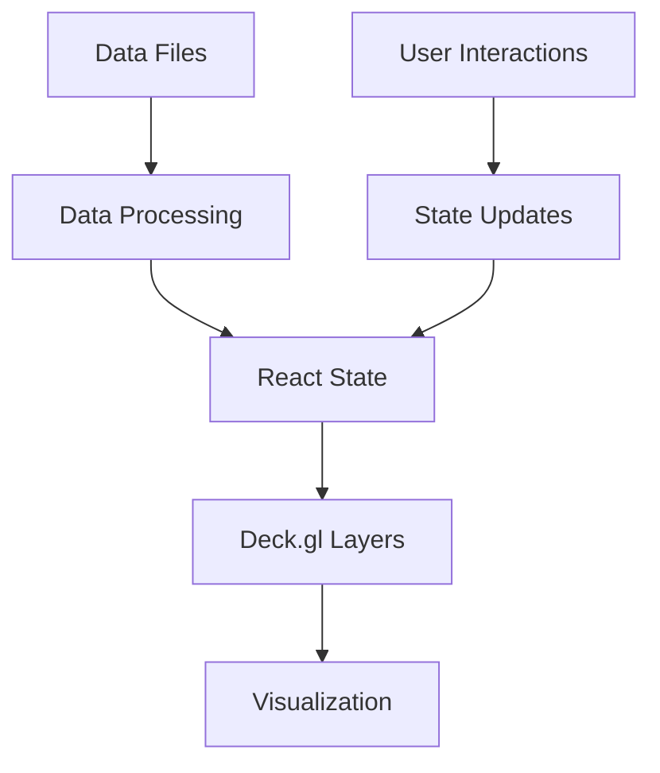

# Interactive Map Setup Design Document

## 1. Overview

This document outlines the design for an interactive infrastructure map of Canada that displays power plants and telecommunications infrastructure. The application will use React with TypeScript, Vite as the build tool, Tailwind CSS v4 for styling, and Deck.gl with Mapbox for visualization.

## 2. Technology Stack

- **Framework**: React 19+ with TypeScript
- **Build Tool**: Vite
- **Styling**: Tailwind CSS v4
- **Mapping**: 
  - `react-map-gl` v8+ for the base map
  - `deck.gl` v9+ for data layers
- **Data Format**: CSV for power plant data, GeoJSON for cable/link data

## 3. Architecture

### 3.1 Component Structure

```
App.tsx
├── DeckGL Map Container
│   ├── Mapbox Base Map
│   ├── ScatterplotLayer (Power Plants)
│   └── PathLayer (Cables and Terrestrial Links)
├── UI Overlays
│   ├── Title Panel
│   ├── Layer Controls
│   ├── Legend
│   └── Info Panel (on hover)
└── Loading Indicator
```

### 3.2 Data Flow



## 4. Core Features

### 4.1 Map Visualization
- Full-screen map centered on Canada
- Power plants rendered as dots using `ScatterplotLayer`
  - Sized by capacity
  - Colored by energy source
- Submarine and terrestrial links rendered as lines using `PathLayer`

### 4.2 UI Components
- Static legend explaining color coding
- Layer control panel to toggle visibility of data types
- Info panel on hover showing asset details
- Loading indicator during data fetch

### 4.3 Data Processing
- Load power plant data from CSV file
- Parse and transform data into typed objects
- Load cable and terrestrial link data from GeoJSON

## 5. Data Models

### 5.1 PowerPlant Interface
```typescript
interface PowerPlant {
  id: string;
  name: string;
  output: number;
  outputDisplay: string;
  source: string;
  coordinates: [number, number]; // [longitude, latitude]
}
```

### 5.2 Cable Interface
```typescript
interface Cable {
  id: string;
  name: string;
  coordinates: [number, number][];
}
```

### 5.3 TerrestrialLink Interface
```typescript
interface TerrestrialLink {
  id: string;
  name: string;
  coordinates: [number, number][];
}
```

## 6. Implementation Plan

### 6.1 Phase 1: Project Initialization
1. Create new Vite project with React TypeScript template
2. Install required dependencies:
   - `react-map-gl`, `mapbox-gl`, `deck.gl`, `@deck.gl/react`, `@deck.gl/layers`
   - `tailwindcss`, `postcss`, `autoprefixer`

### 6.2 Phase 2: Build System Configuration
1. Configure Tailwind CSS with proper content paths
2. Set up PostCSS in Vite configuration
3. Configure Tailwind directives in CSS file
4. Set up environment variables for Mapbox token

### 6.3 Phase 3: Data Processing
1. Create TypeScript interfaces for data models
2. Implement data loading functions for CSV and GeoJSON
3. Create utility functions for data transformation

### 6.4 Phase 4: UI Implementation
1. Implement main App component with DeckGL and Mapbox
2. Create layer controls for toggling visibility
3. Implement legend component
4. Add hover info panel
5. Add loading indicator

### 6.5 Phase 5: Testing and Deployment
1. Verify functionality locally
2. Test responsive design
3. Optimize performance

## 7. Styling Strategy

- Use Tailwind CSS v4 for all styling
- Implement dark theme with dark grey backgrounds and white text
- Use backdrop blur effects for semi-transparent panels
- Responsive design for different screen sizes

## 8. Color Coding

| Energy Source | Color        | RGB Values   |
|---------------|--------------|--------------|
| Hydro         | Blue         | [31, 119, 180] |
| Gas           | Orange       | [255, 127, 14] |
| Wind          | Green        | [44, 160, 44]  |
| Nuclear       | Red          | [214, 39, 40]  |
| Coal          | Grey         | [100, 100, 100]|
| Solar         | Yellow       | [255, 215, 0]  |
| Other         | Purple       | [148, 103, 189]|

## 9. Configuration Files

### 9.1 Tailwind Configuration
```javascript
/** @type {import('tailwindcss').Config} */
export default {
  content: [
    "./index.html",
    "./src/**/*.{js,ts,jsx,tsx}",
  ],
  theme: {
    extend: {},
  },
  plugins: [],
}
```

### 9.2 Vite Configuration
```typescript
import { defineConfig } from 'vite'
import react from '@vitejs/plugin-react'
import tailwindcss from 'tailwindcss'

export default defineConfig({
  plugins: [react()],
  css: {
    postcss: {
      plugins: [
        tailwindcss(),
      ],
    },
  },
})
```

## 10. Environment Variables

- `VITE_MAPBOX_TOKEN`: Mapbox access token for base map

## 11. Performance Considerations

- Use `useMemo` for layer creation to prevent unnecessary re-renders
- Implement proper data loading and error handling
- Optimize data processing functions
- Use appropriate layer properties for performance (radiusMinPixels, widthMinPixels)

## 12. Testing Strategy

- Unit tests for data processing functions
- Component tests for UI elements
- Integration tests for map interactions
- Performance testing for large datasets